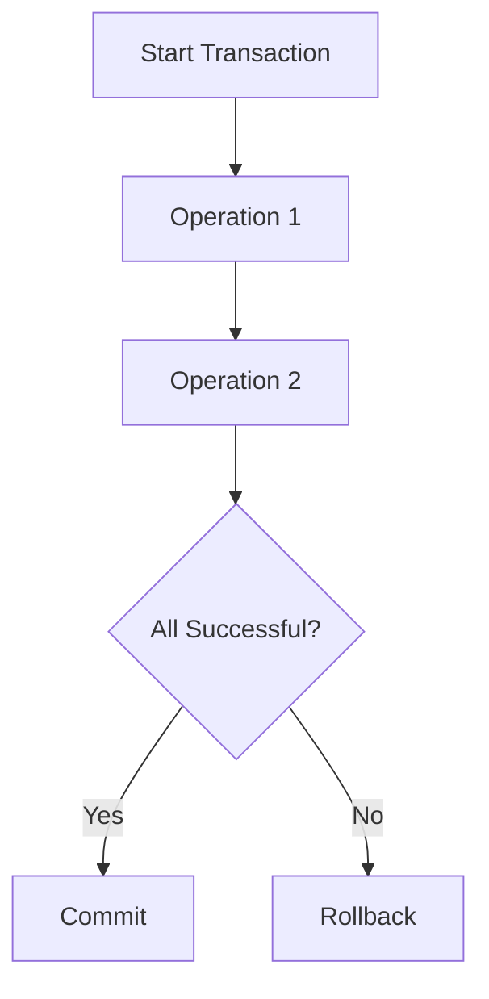
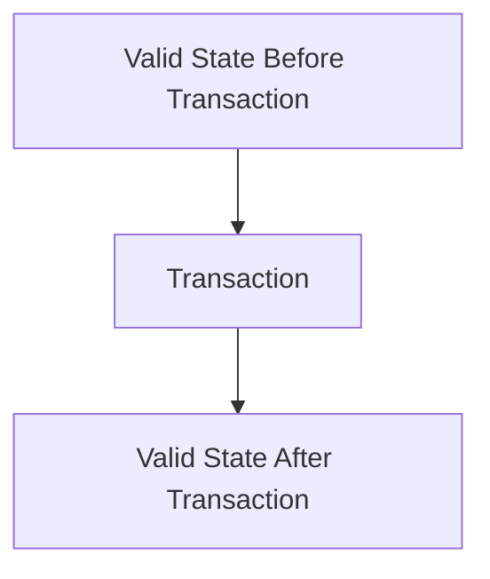
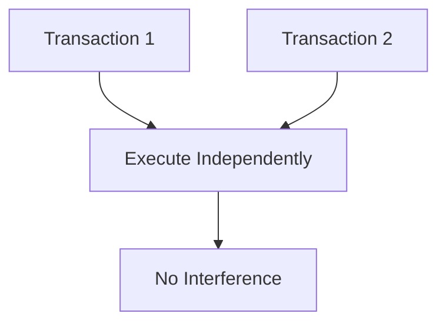
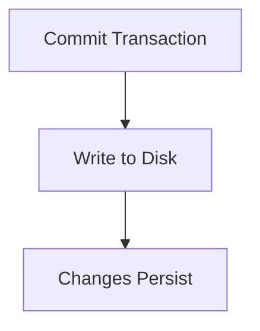

# ACID in Databases

ACID is an acronym that represents the four key properties of database transactions: **Atomicity**, **Consistency**, **Isolation**, and **Durability**. These properties ensure reliable processing of database transactions, even in the presence of errors, power failures, or other issues.

---

## 1. Atomicity
Atomicity ensures that a transaction is treated as a single, indivisible unit. Either all operations within the transaction are completed successfully, or none of them are applied.

---

## 2. Consistency
Consistency ensures that a database remains in a valid state before and after a transaction. Any transaction must transition the database from one valid state to another.

---

## 3. Isolation
Isolation ensures that concurrent transactions do not interfere with each other. The outcome of a transaction is not affected by other transactions running simultaneously.

---

## 4. Durability
Durability guarantees that once a transaction is committed, its changes are permanent, even in the event of a system crash.

---

By adhering to the ACID properties, databases ensure data integrity and reliability, making them essential for critical applications.