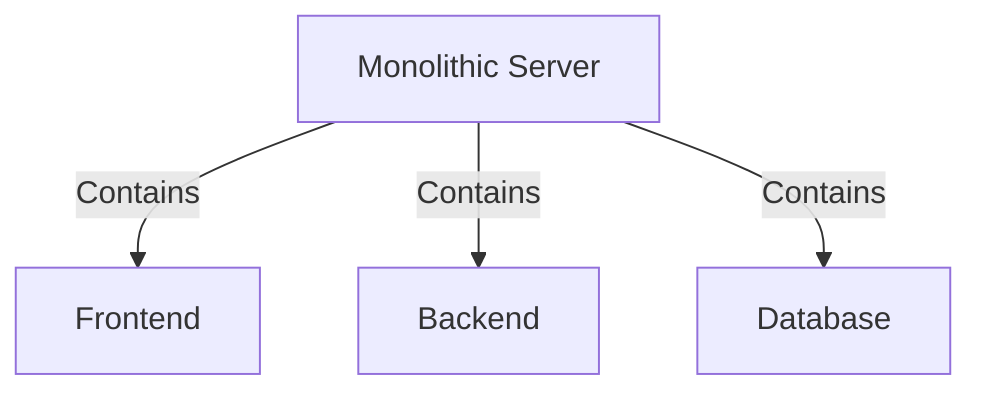
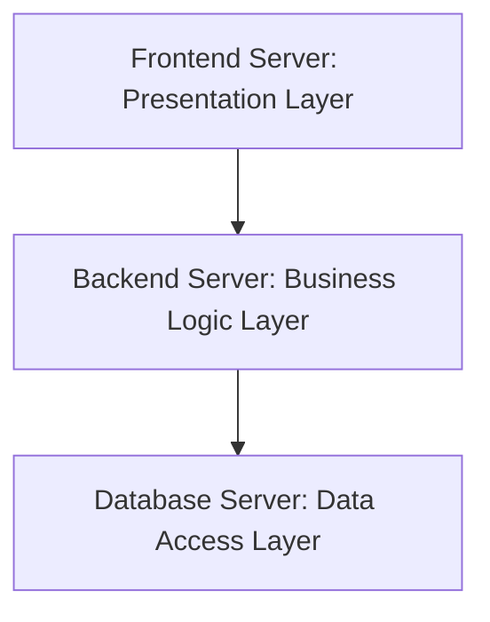
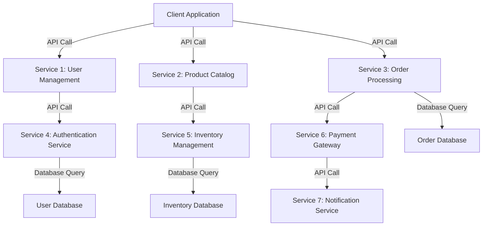
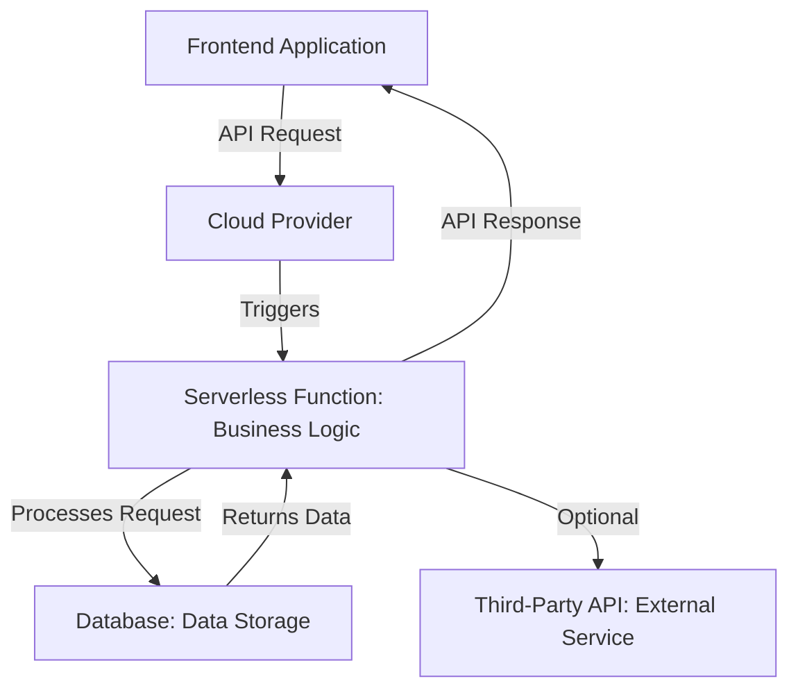
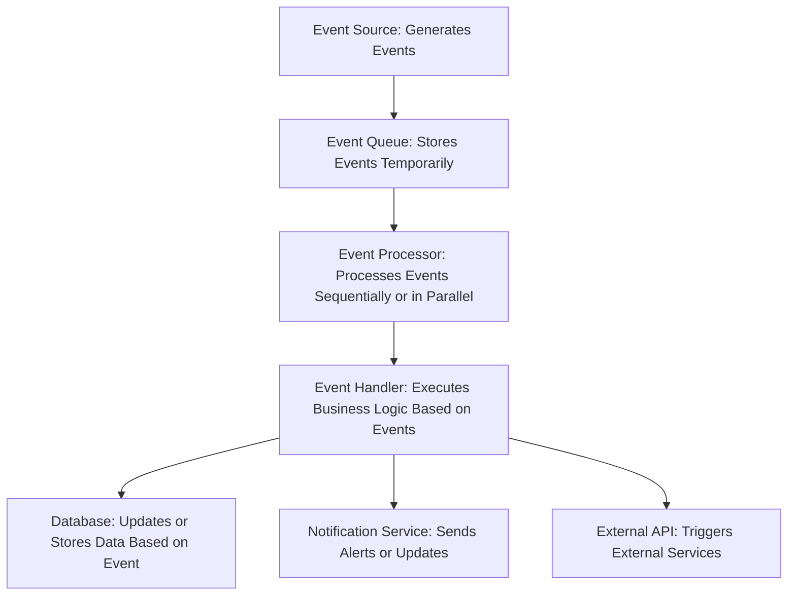
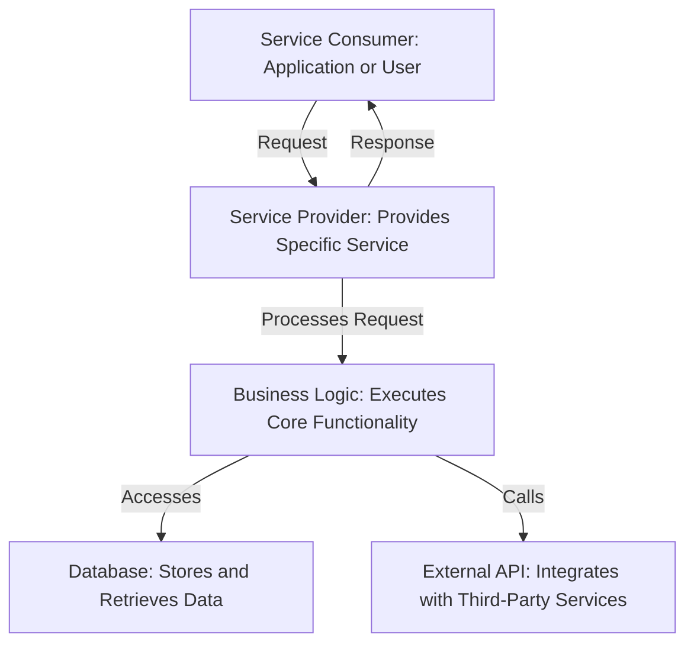

Architecture Design is a way to organize the system's components and their interactions to meet specified requirements. It involves defining the structure, behavior, and more views of the system to ensure it fulfills its intended purpose efficiently and effectively.

## Types of Architecture Design

### Monolithic Architecture

Monolithic architecture is a traditional model of software design. In this architecture, all components of the system are interconnected and interdependent, and they are deployed as a single unit on one server. This means that the database, frontend, backend, and business logic components are tightly coupled, which can make the system easier to develop initially but harder to scale and maintain over time. Changes to one part of the system often require redeploying the entire application, which can lead to longer development cycles and increased risk of introducing bugs.

Examples:

- Laravel (using Blade, having the database on the same server)
- Laravel with embedded frontend framework (using Inertia with Vue or React)

---

### Three-Tier Architecture

Three-tier architecture is a client-server architecture pattern that divides the application into three logical layers: the presentation layer, the business logic layer, and the data access layer. This separation allows for better scalability, maintainability, and manageability of the application. This design is highly maintainable; for example, if we need more computational power on the backend, we can simply add more servers to the backend without worrying about the database or frontend.

#### Diagram:

Each layer is hosted on a separate server:

- **Frontend Server**: Handles the user interface and user interactions.
- **Backend Server**: Processes business logic, handles API requests, and communicates with the database.
- **Database Server**: Stores and manages the application's data.

Examples:

- A web application with a **React** or **Vue** frontend (presentation layer), **Node.js/Express**, **Laravel API** backend (business logic layer), and **MySQL**, **MSSQL**, **MongoDB** database (data access layer).

---

### Microservices Architecture

Microservices architecture is an approach where the application is composed of small, independent services that communicate over well-defined APIs. Each service is focused on a specific business capability and can be developed, deployed, and scaled independently.

#### Diagram:

This architecture enables independent scaling, development, and deployment of each service, improving flexibility and fault isolation.

---

### Serverless Architecture

Serverless architecture allows developers to build and run applications without managing the underlying infrastructure. In this model, the cloud provider automatically provisions, scales, and manages the servers needed to run the code. This approach can reduce operational complexity and cost.

#### Diagram:

This approach eliminates the need to manage servers, allowing developers to focus on writing code while the cloud provider handles scaling and infrastructure.

---

### Event-Driven Architecture

Event-driven architecture is a design pattern in which the flow of the program is determined by events such as user actions, sensor outputs, or messages from other programs. This architecture is highly scalable and can handle a large number of events efficiently.

#### Diagram:

---

### Service-Oriented Architecture (SOA)

Service-oriented architecture is a design pattern where services are provided to other components by application components, through a communication protocol over a network. It allows for integration and reuse of services across different applications and systems.

#### Diagram:

This detailed diagram illustrates the flow of a request from the service consumer to the service provider, including interactions with the business logic, database, and external APIs.
