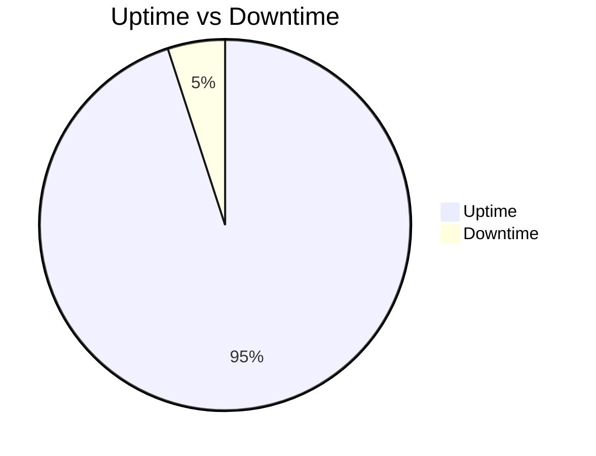
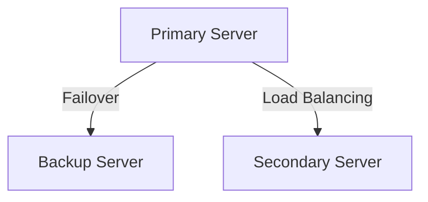

# Availability

## Introduction

Availability is a measure of a system's ability to remain operational and accessible when required for use. It is a critical aspect of system design, especially for applications that require high reliability and uptime.

## Key Concepts

### Uptime and Downtime

- **Uptime**: The amount of time a system is operational and available.
- **Downtime**: The amount of time a system is not operational or accessible.

### High Availability (HA)

High Availability refers to systems that are designed to be operational and accessible for a very high percentage of time. This is often achieved through redundancy and failover mechanisms.

### The Nine's of Availability

The term "nine's of availability" is used to describe the percentage of time a system is expected to be operational in a given year. Each additional nine represents a higher level of availability.

- **99% availability (Two Nines)**: Approximately 3.65 days of downtime per year. Example: Internal business applications where occasional downtime is acceptable.
- **99.9% availability (Three Nines)**: Approximately 8.77 hours of downtime per year. Example: E-commerce websites where downtime can affect sales but is not critical.
- **99.99% availability (Four Nines)**: Approximately 52.6 minutes of downtime per year. Example: Online banking systems where high availability is crucial for customer trust.
- **99.999% availability (Five Nines)**: Approximately 5.26 minutes of downtime per year. Example: Telecommunications networks where continuous service is essential.
- **99.9999% availability (Six Nines)**: Approximately 31.5 seconds of downtime per year. Example: Critical infrastructure systems such as air traffic control where downtime can have severe consequences.

Achieving higher levels of availability typically requires more sophisticated and costly infrastructure, including redundant systems, failover mechanisms, and robust monitoring and maintenance practices. This often involves adding more backup servers to ensure that if one server fails, others can take over seamlessly.
