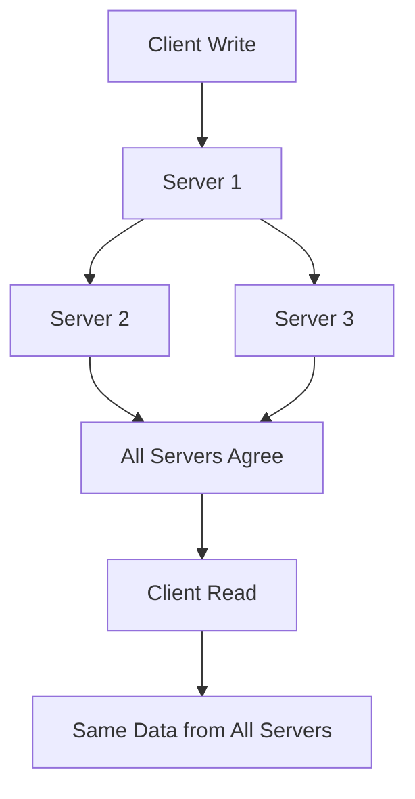
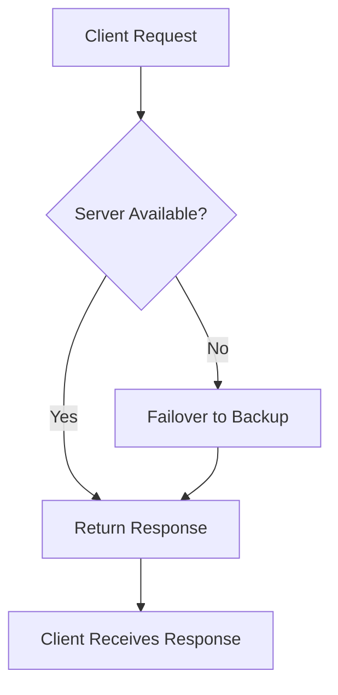
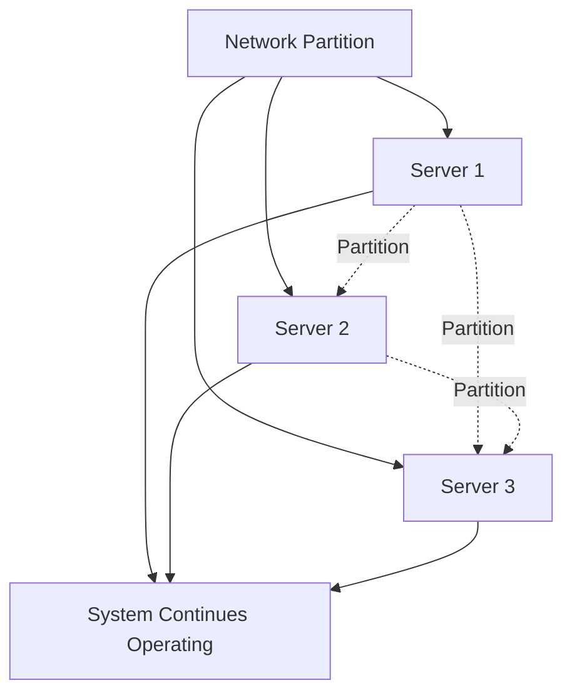
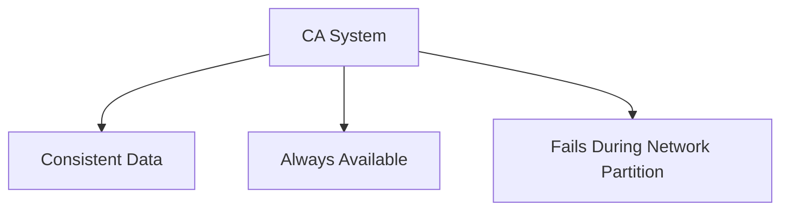
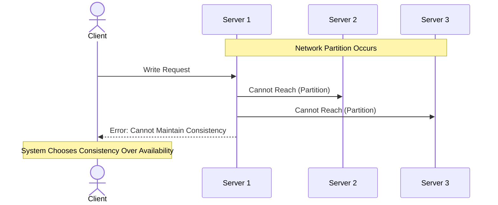
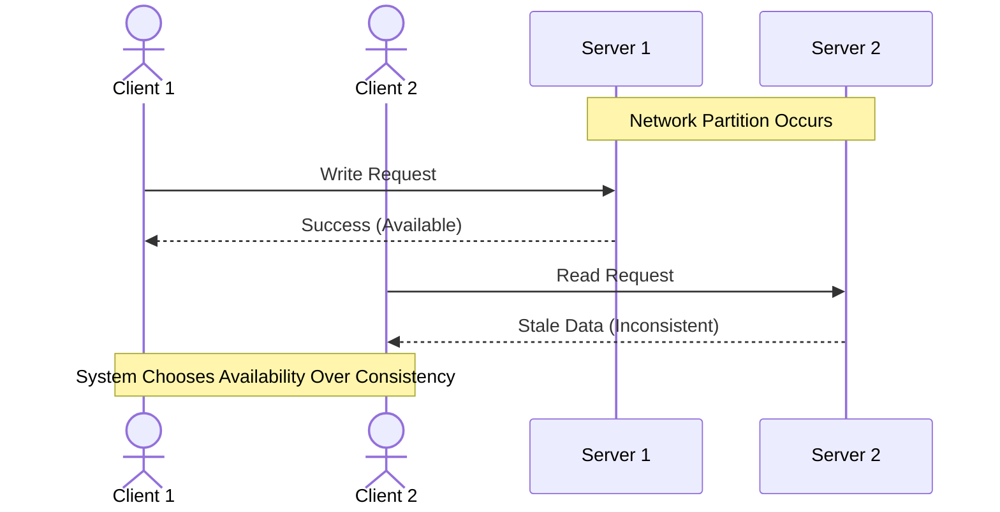
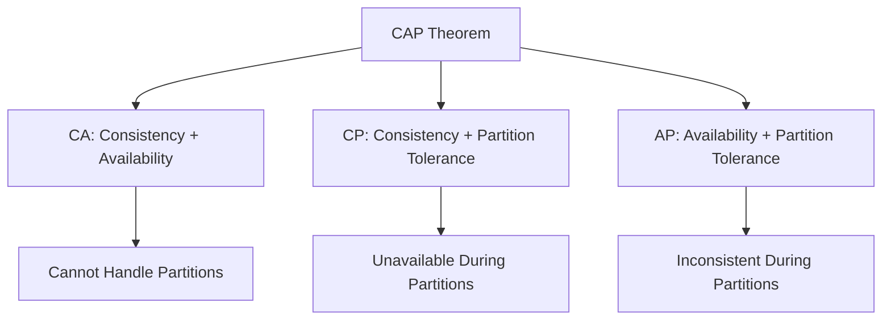
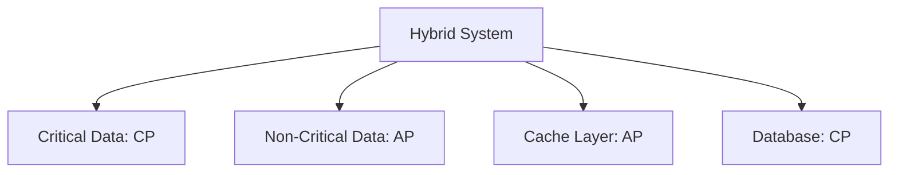

# CAP Theorem

The CAP theorem, also known as Brewer's theorem, is a fundamental principle in distributed systems that states it is impossible for a distributed data store to simultaneously provide more than two out of three guarantees:

- **C**onsistency
- **A**vailability
- **P**artition tolerance

## The Three Guarantees

### Consistency (C)

Consistency means that all nodes in a distributed system see the same data at the same time. Every read receives the most recent write or an error. In a consistent system, once data is written, all subsequent reads will return that same data until it is overwritten.

> **Note**: Consistency in CAP theorem refers to **linearizability** (strong consistency), not eventual consistency. [[Consistency]]

### Availability (A)

Availability means that every request receives a response (not an error), even if one or more nodes are down. The system remains operational and accessible at all times, without downtime.

> **Note**: Availability in CAP theorem means that every non-failing node must be able to process requests. [[Availability]]

### Partition Tolerance (P)

Partition tolerance means the system continues to operate despite network partitions (communication failures between nodes). The system must handle cases where messages are delayed or lost between nodes.

> **Key Insight**: In real-world distributed systems, network partitions are inevitable, so partition tolerance is typically a requirement, not a choice.

## The CAP Trade-off

The CAP theorem states that you can only guarantee **two out of three** properties at any given time. This creates three possible system configurations:

### CA (Consistency + Availability)

Systems that prioritize consistency and availability but sacrifice partition tolerance. These systems cannot handle network partitions gracefully.

**Characteristics:**
- All nodes see the same data simultaneously
- System remains available for all requests
- Cannot handle network partitions (will fail or become unavailable during partitions)

**Example:** Traditional single-node databases, or tightly coupled systems that assume perfect network connectivity.

> **Reality Check**: In practice, true CA systems are rare because network partitions are unavoidable in distributed systems. Most systems must choose between CP and AP.

### CP (Consistency + Partition Tolerance)

Systems that prioritize consistency and partition tolerance but sacrifice availability. During a network partition, these systems will reject requests to maintain consistency.

**Characteristics:**
- All nodes see the same data (strong consistency)
- Can handle network partitions
- May become unavailable during partitions to maintain consistency

**Example:** Distributed databases like MongoDB (with strong consistency mode), HBase, or systems using consensus algorithms like Raft or Paxos.

**Use Cases:**
- Financial systems where data accuracy is critical
- Systems where stale data could cause serious problems
- Applications that can tolerate temporary unavailability

### AP (Availability + Partition Tolerance)

Systems that prioritize availability and partition tolerance but sacrifice consistency. These systems remain available during partitions but may return stale or inconsistent data.

**Characteristics:**
- System remains available even during partitions
- Can handle network partitions gracefully
- May return inconsistent data (eventual consistency)

**Example:** Distributed databases like Cassandra, DynamoDB, or systems using eventual consistency models.

**Use Cases:**
- Social media feeds where slight delays are acceptable
- Content delivery networks (CDNs)
- Systems where availability is more important than perfect consistency
- Applications that can handle eventual consistency

## Visual Representation of CAP Theorem

## Common Misconceptions

### Misconception 1: "You must choose one property to sacrifice"

**Reality:** The CAP theorem states that during a network partition, you must choose between consistency and availability. In normal operation (no partition), a system can provide all three properties.

### Misconception 2: "Partition tolerance is optional"

**Reality:** In distributed systems, network partitions are inevitable. You cannot avoid them, so partition tolerance is typically a requirement. This means you're really choosing between CP and AP.

### Misconception 3: "CAP applies to all aspects of a system"

**Reality:** CAP theorem applies to individual operations or data items, not the entire system. Different parts of a system can make different CAP trade-offs.

### Misconception 4: "Consistency means ACID consistency"

**Reality:** CAP consistency refers to **linearizability** (strong consistency), which is different from ACID consistency. ACID consistency refers to database integrity constraints.

## Practical Implications

### Choosing the Right Trade-off

The choice between CP and AP depends on your application's requirements:

**Choose CP when:**
- Data accuracy is critical (financial transactions, medical records)
- Stale data could cause serious problems
- Temporary unavailability is acceptable
- Strong consistency is required

**Choose AP when:**
- High availability is critical (social media, content delivery)
- Slight data inconsistency is acceptable
- System must remain operational during failures
- Eventual consistency is sufficient

### Hybrid Approaches

Many modern systems use hybrid approaches:

1. **Tunable Consistency**: Allow developers to choose consistency level per operation
2. **CRDTs (Conflict-free Replicated Data Types)**: Data structures that automatically resolve conflicts
3. **Quorum-based Systems**: Require a majority of nodes to agree, balancing consistency and availability
4. **Multi-model Systems**: Different parts of the system use different CAP trade-offs

## Real-World Examples

### CP Systems

- **MongoDB** (with strong consistency): Ensures all reads see the most recent write
- **HBase**: Strongly consistent NoSQL database
- **ZooKeeper**: Coordination service with strong consistency guarantees

### AP Systems

- **Cassandra**: Highly available with eventual consistency
- **Amazon DynamoDB**: Eventually consistent by default
- **CouchDB**: Document database with eventual consistency

### CA Systems (Rare in Practice)

- **Traditional RDBMS** (single node): MySQL, PostgreSQL on a single server
- **In-memory databases**: Redis (single instance)

> **Important**: Most distributed systems are either CP or AP, as network partitions are unavoidable in real-world scenarios.

## CAP Theorem and ACID

It's important to distinguish between CAP consistency and ACID consistency:

- **CAP Consistency**: All nodes see the same data at the same time (linearizability)
- **ACID Consistency**: Database integrity constraints are maintained

A system can be ACID-compliant while making different CAP trade-offs. For example, a CP system can use ACID transactions within each partition.

## Summary

The CAP theorem is a fundamental principle that helps system designers understand the inherent trade-offs in distributed systems:

1. **You cannot have all three** properties simultaneously in a distributed system
2. **Partition tolerance is usually required**, making the choice between CP and AP
3. **The choice depends on your application's requirements** and tolerance for inconsistency or unavailability
4. **Modern systems often use hybrid approaches** to optimize for different use cases

> **Key Takeaway**: Understanding CAP theorem helps you make informed decisions about system design and choose the right trade-offs for your specific use case.

---

### Related Topics

- [[Consistency]]
- [[Availability]]
- [[Distributed Computing]]
- [[Strong Consistency]]
- [[Eventual Consistency]]

