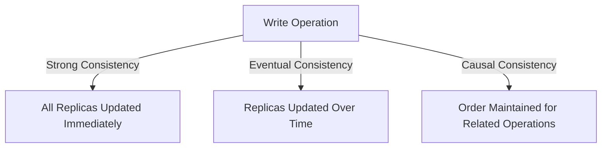
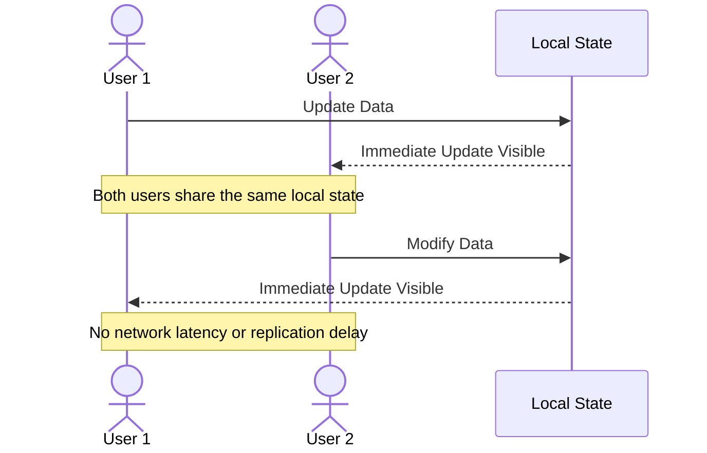
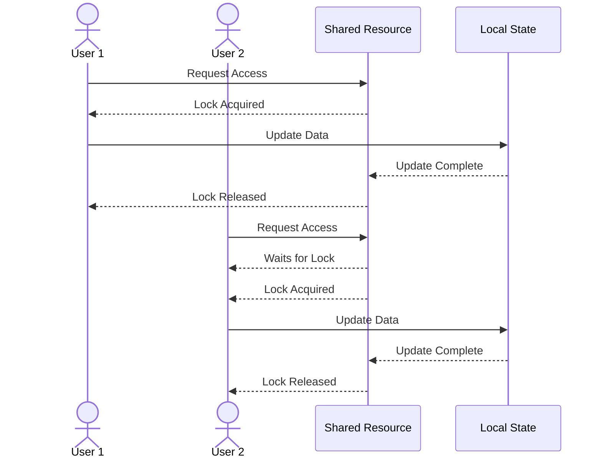
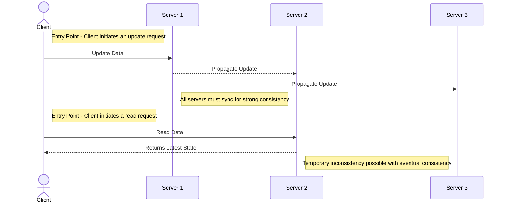
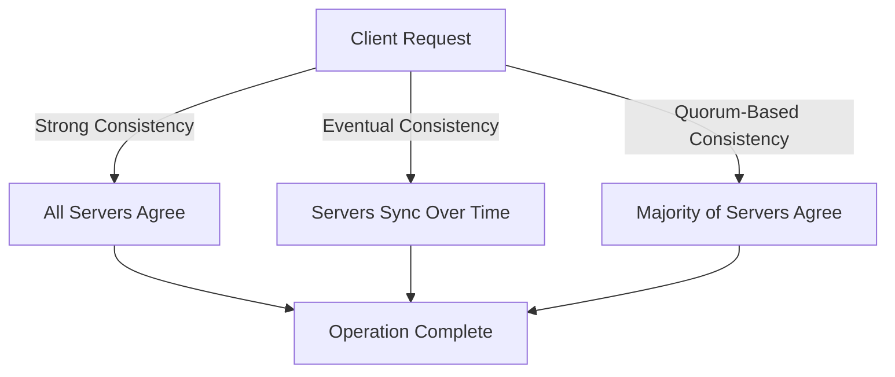
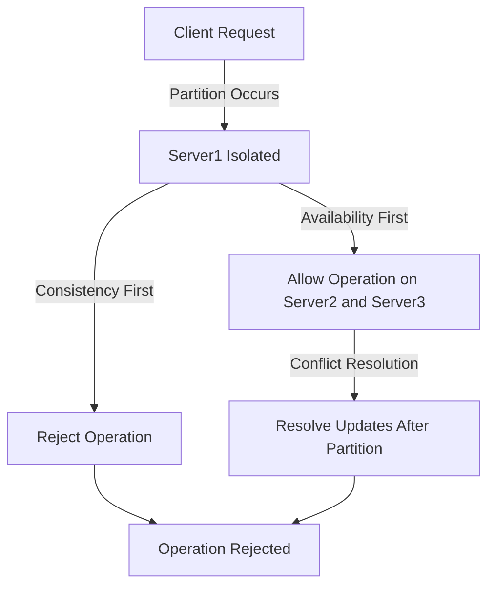
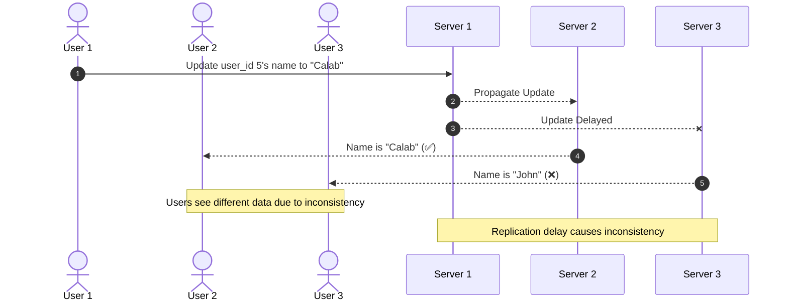

Consistency in system design refers to ensuring that all users or nodes in a distributed system see the same data at the same time. This is crucial for maintaining the integrity and reliability of the system. There are different types of consistency models, such as:

- **Strong Consistency**: Guarantees that once a write is acknowledged, all subsequent reads will reflect that write. [[Strong Consistency]]

- **Eventual Consistency**: Ensures that, given enough time, all replicas will converge to the same value. 
- [[Eventual Consistency]]

- **Causal Consistency**: Ensures that causally related operations are seen by all nodes in the same order.

Choosing the right consistency model depends on the specific requirements and trade-offs of your system.

> **Note**: Understanding the trade-offs between consistency, availability, and partition tolerance (CAP theorem) is essential when designing distributed systems.

---

### Scenario: Two Users Accessing from the Same Computer

If two users are accessing the system from the same computer, the data consistency is inherently strong because both users are interacting with the same local state. Since there is no network latency or replication delay involved, any updates made by one user are immediately visible to the other. This scenario eliminates the need for distributed consistency mechanisms, as the data is fully synchronized in real-time on the same machine.

However, concurrency must still be handled properly to avoid conflicts. Below are some strategies:

- **Locking Mechanisms**: Ensure that only one user can modify a resource at a time.
- **Atomic Operations**: Guarantee that updates are applied as a single, indivisible operation.
- **Conflict Resolution**: Define clear rules for resolving simultaneous updates, if applicable.

> **Tip**: Even in local systems, testing for race conditions and concurrency issues is critical to ensure data integrity.

#### Diagram: Local Consistency with Two Users

---

#### Diagram: Handling Concurrency Locally

> **Reminder**: Implementing proper locking or atomic operations can prevent data corruption in concurrent environments.

---

### Scenario: Three Servers in a Distributed System

In a distributed system with three servers, maintaining consistency becomes more complex due to potential network delays, partitioning, and replication. The choice of a consistency model will significantly impact the behavior of the system. Below are some considerations:

- **Strong Consistency**: All three servers must agree on the state of the data before any operation is considered complete. This often requires a consensus protocol like Paxos or Raft. 
- **Eventual Consistency**: Updates are propagated asynchronously, and the servers will eventually converge to the same state. This model is more tolerant of network partitions but may lead to temporary inconsistencies.
- **Quorum-Based Consistency**: A subset of servers (a quorum) must agree on the state of the data for an operation to be considered valid. This balances consistency and availability.

> **Insight**: The choice of consistency model directly impacts system performance and user experience.

#### Diagram: Three Servers with Different Consistency Models

---

#### Handling Network Partitions

When a network partition occurs, the system must decide between consistency and availability (as per the CAP theorem). Below are some strategies:

- **Consistency First**: Reject operations that cannot be confirmed by all servers.
- **Availability First**: Allow operations on available servers and resolve conflicts later.
- **Partition Tolerance**: Use techniques like vector clocks or conflict-free replicated data types (CRDTs) to manage updates during partitions.

> **Best Practice**: Design your system to handle network partitions gracefully, ensuring minimal disruption to users.

#### Diagram: Network Partition with Three Servers

> **Insight**: The choice between consistency and availability during a partition depends on the system's requirements and the expected user experience.

> **Key Takeaway**: Balancing consistency, availability, and performance is a critical challenge in distributed systems.

---

### Example: Inconsistent State Across Servers and Users

In this example, we have three users interacting with a distributed system consisting of three servers. User1 updates the name of `user_id 5` from "John" to "Calab". Server2 and User2 receive the updated data, but Server3 and User3 still see the old data due to replication delays. This demonstrates an inconsistent state in the system.

#### Diagram: Inconsistent State Across Servers and Users

> **Observation**: This inconsistency occurs because the update has not yet propagated to all servers. Such scenarios are common in systems with eventual consistency.
---