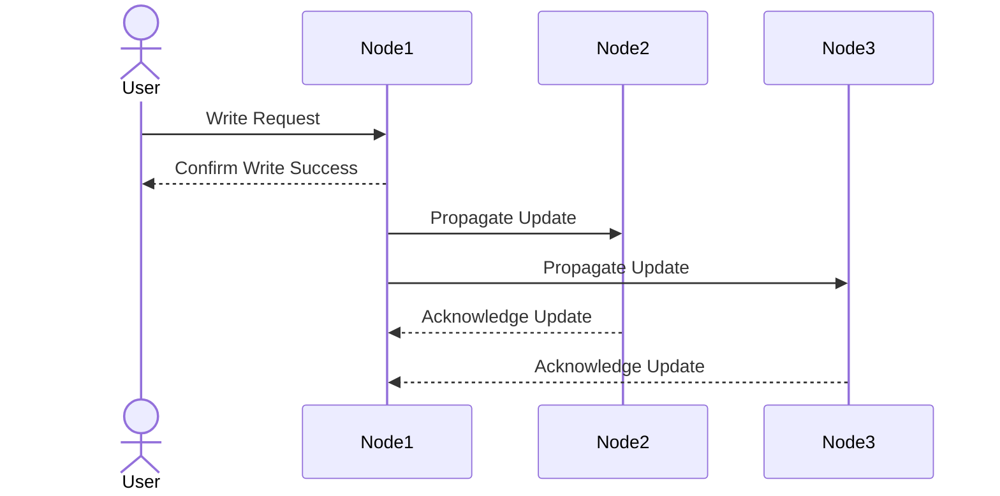

Eventual consistency ensures that all nodes in a distributed system will eventually reflect the same data, but not necessarily at the same time. This means that a read operation may return stale data until the system converges to a consistent state.

## Key Characteristics
- **Eventual Convergence**: All updates will propagate to all nodes, ensuring consistency over time.
- **High Availability**: The system remains operational even during network partitions.
- **Asynchronous Updates**: Changes are propagated to other nodes without waiting for immediate acknowledgment.

## Advantages
- Low latency as updates do not require immediate synchronization.
- High availability, making it suitable for distributed systems with frequent network partitions.

## Disadvantages
- Potential for stale reads until the system converges.
- Requires additional application logic to handle inconsistencies during the convergence period.

## Example Use Case
Social media platforms where eventual consistency is acceptable for features like post likes or comments.

## Eventual Consistency Workflow

In this workflow:
1. The client sends a write request to one node.
2. The node immediately confirms the write success to the client.
3. The update is asynchronously propagated to other nodes.
4. Over time, all nodes converge to the same state.

## Conclusion
Eventual consistency is ideal for systems prioritizing availability and low latency over immediate consistency, but it requires careful handling of temporary inconsistencies.  