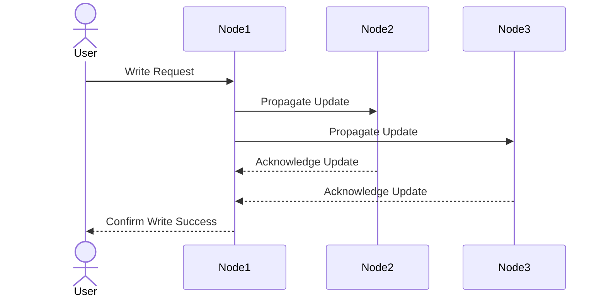

Strong consistency ensures that all nodes in a distributed system reflect the same data at any given time. This guarantees that any read operation will always return the most recent write. When we tries to update some change to one server, it is pending until all servers agrees on the change and update all at the same time.

## Key Characteristics
- **Immediate Consistency**: Updates are visible across all nodes instantly.
- **Single System Image**: The system behaves as if there is only one copy of the data.
- **Strict Ordering**: All operations are executed in a globally agreed order.

## Advantages
- Simplifies application logic as developers can assume data is always up-to-date.
- Suitable for systems where correctness is critical, such as financial systems.

## Disadvantages
- Higher latency due to synchronization overhead.
- Reduced availability during network partitions (as per the CAP theorem).

## Example Use Case
Banking systems where account balances must always be accurate.
Military command and control systems where decisions and actions must be based on the most up-to-date and accurate information to ensure mission success and avoid errors.

## Strong Consistency Workflow

In this workflow:
1. The client sends a write request to one node.
2. The node propagates the update to all other nodes.
3. Once all nodes acknowledge the update, the client receives confirmation.

## Conclusion
Strong consistency is ideal for scenarios requiring strict data accuracy but comes with trade-offs in latency and availability.