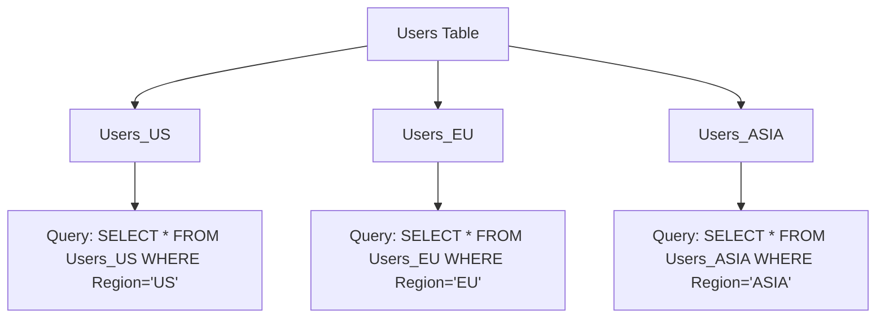

# Horizontal Partitioning

Horizontal partitioning, also known as [[Sharding]], is a database design technique where rows of a table are divided across multiple smaller tables, called partitions or shards. Each partition contains a subset of the rows, and all partitions together represent the complete dataset. This approach is commonly used to improve scalability, performance, and manageability of large databases.

## How Horizontal Partitioning Works

In horizontal partitioning, the rows of a table are distributed based on a specific criterion, such as a range of values, a hash function, or a list of keys. Each partition is stored on a separate database instance or server, allowing queries to be executed on a smaller subset of data.

### Benefits of Horizontal Partitioning
- **Improved Performance**: Queries can be executed on a smaller dataset, reducing response time.
- **Scalability**: New partitions can be added as the dataset grows, enabling horizontal scaling.
- **Fault Isolation**: If one partition fails, the others remain unaffected, improving system reliability.

### Example Database

Consider a database table `Users` with the following schema:

| UserID | Name       | Region  |
|--------|------------|---------|
| 1      | Alice      | US      |
| 2      | Bob        | EU      |
| 3      | Charlie    | US      |
| 4      | Diana      | EU      |
| 5      | Ethan      | ASIA    |

We can horizontally partition this table based on the `Region` column into three partitions:

#### Partition 1: `Users_US`
| UserID | Name   | Region |
|--------|--------|--------|
| 1      | Alice  | US     |
| 3      | Charlie| US     |

#### Partition 2: `Users_EU`
| UserID | Name   | Region |
|--------|--------|--------|
| 2      | Bob    | EU     |
| 4      | Diana  | EU     |

#### Partition 3: `Users_ASIA`
| UserID | Name   | Region |
|--------|--------|--------|
| 5      | Ethan  | ASIA   |

### Accessing Data in a Partition

When querying data, the application determines the relevant partition based on the partitioning key (in this case, `Region`). For example, if we want to retrieve all users in the `US` region, the query will only access the `Users_US` partition.

### Mermaid Diagram

Below is a Mermaid diagram illustrating the horizontal partitioning of the `Users` table:

In this setup, each partition operates independently, and queries are directed to the appropriate partition based on the data's region.

Horizontal partitioning is a powerful technique for managing large datasets, especially in distributed systems, where scalability and performance are critical.