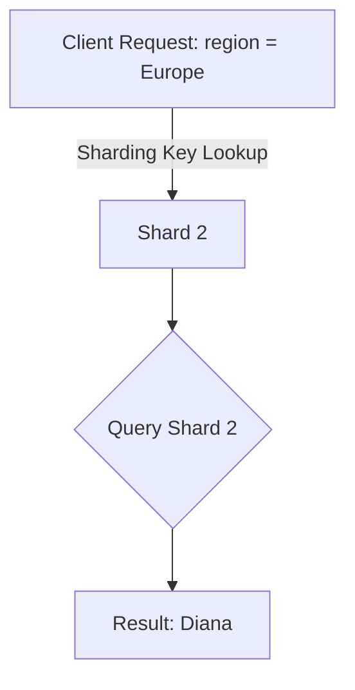

Sharding is a database architecture pattern that involves splitting a large database into smaller, more manageable pieces called "shards." Each shard is an independent database that contains a subset of the overall data. Sharding is often used to improve scalability, performance, and availability in distributed systems.

## How Sharding Works

In a sharded database, data is distributed across multiple nodes (shards) based on a sharding key. The sharding key is a column or a combination of columns that determines how data is partitioned. Each shard is responsible for storing and managing a specific subset of the data.

### Benefits of Sharding
1. **Scalability**: By distributing data across multiple shards, the system can handle larger datasets and higher traffic.
2. **Performance**: Queries are executed on a smaller subset of data, reducing latency.
3. **Fault Tolerance**: If one shard fails, the others remain operational, improving system availability.

### Example: Region-Based Sharding

Imagine a user database with millions of users distributed across different regions. To shard the database, we can use the `region` as the sharding key. Users from specific regions are stored in different shards.

#### Shard Distribution
- **Shard 1**: Users from North America
- **Shard 2**: Users from Europe
- **Shard 3**: Users from Asia

#### Data in Shards

- **Shard 1**:

| user_id | name  | region        |
|---------|-------|---------------|
| 1       | Alice | North America |
| 2       | Bob   | North America |

- **Shard 2**:

| user_id | name    | region |
|---------|---------|--------|
| 1001    | Charlie | Europe |
| 1002    | Diana   | Europe |

- **Shard 3**:

| user_id | name   | region |
|---------|--------|--------|
| 2001    | Eve    | Asia   |
| 2002    | Frank  | Asia   |

### Accessing Data in a Sharded Database

When accessing data, the system uses the sharding key (in this case, `region`) to determine which shard contains the requested data. For example, if we want to retrieve information for a user in Europe, the system will query **Shard 2** directly, avoiding unnecessary queries to other shards.

### Mermaid Diagram

In this diagram:
1. The client sends a request for data in the `Europe` region.
2. The system determines that the data resides in **Shard 2**.
3. The query is executed on **Shard 2**, and the result is returned.

### When to Use Sharding

Sharding is suitable for:
- Applications with very large datasets that exceed the capacity of a single database.
- Systems with high query loads that require horizontal scaling.
- Use cases where data can be easily partitioned using a sharding key.

However, sharding introduces complexity in terms of data management, rebalancing shards, and ensuring consistency. It should be implemented only when necessary.
