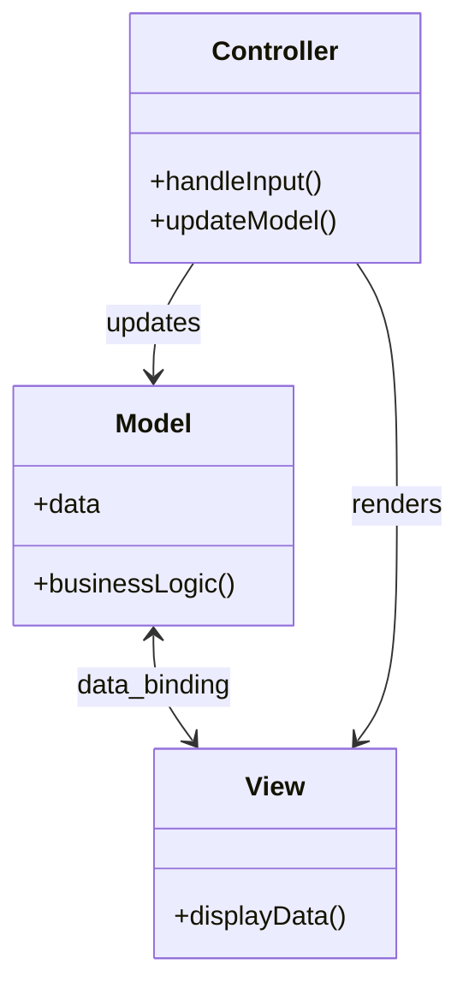
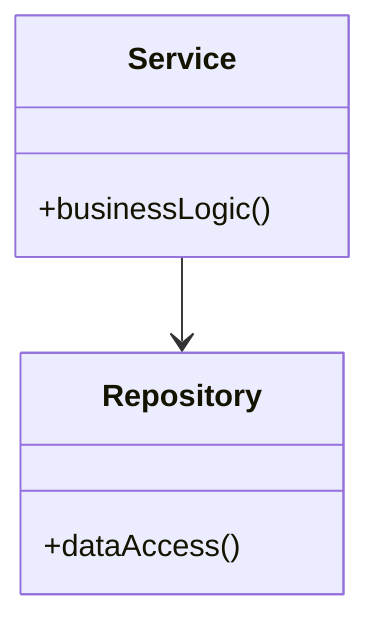
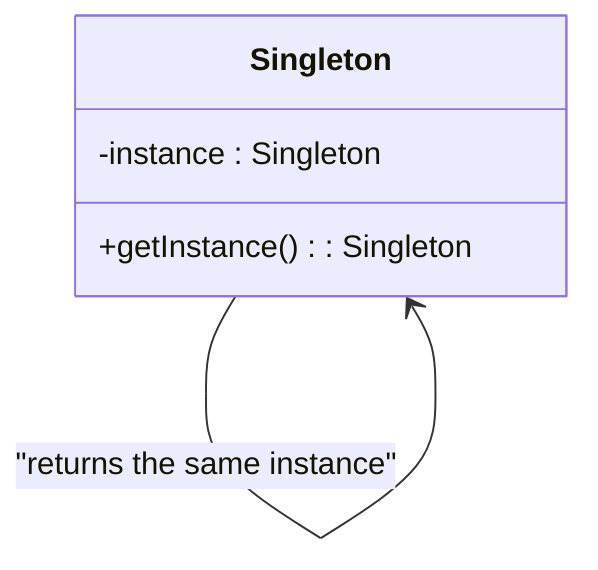
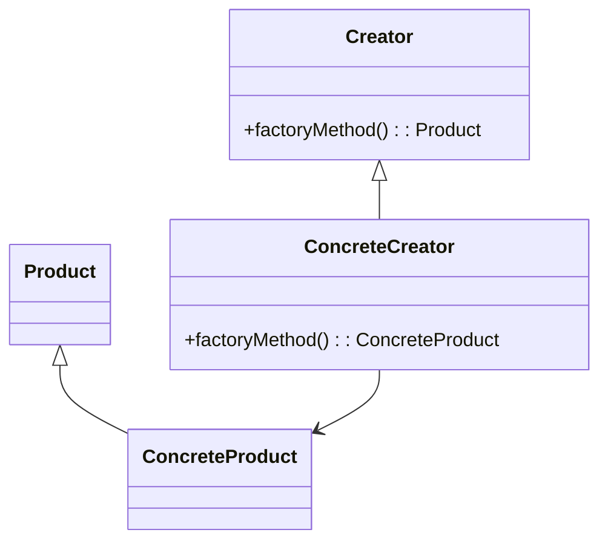
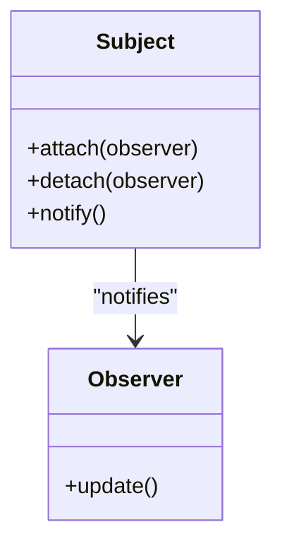
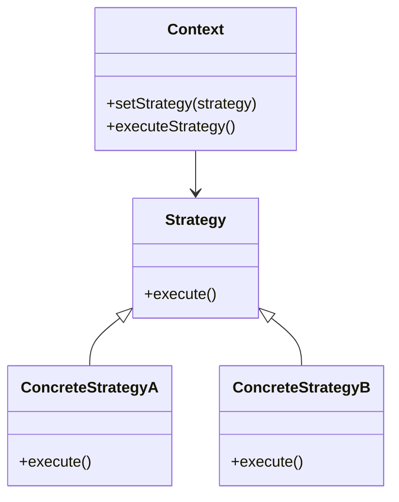

# Design Patterns

Design patterns are a way to organize the code for more efficient and maintainable software development. They provide solutions to common problems that software developers face, making it easier to design robust and scalable systems. By using design patterns, developers can improve code readability, reduce complexity, and enhance collaboration within the development team.

## List of Design Patterns

### MVC Pattern

- **Model-View-Controller (MVC)**: Separates an application into three interconnected components.
  - **Model**: Represents the data and the business logic.
  - **View**: Displays the data (UI).
  - **Controller**: Handles the input and updates the Model.

This separation helps in organizing code, making it more modular and easier to maintain.

### Service and Repository Patterns

- **Service**: Encapsulates the business logic of an application, providing a layer of abstraction between the presentation layer and the data access layer. It promotes code reusability and separation of concerns.
- **Repository**: Provides an abstraction over data storage, allowing the business logic to interact with data sources without needing to know the details of data access. It helps in achieving a clean separation between the domain and data mapping layers.

### Singleton Pattern

- **Singleton**: Ensures a class has only one instance and provides a global point of access to it.

### Factory Method Pattern

- **Factory Method**: Defines an interface for creating an object, but lets subclasses alter the type of objects that will be created.

### Observer Pattern

- **Observer**: Defines a one-to-many dependency between objects so that when one object changes state, all its dependents are notified and updated automatically.

### Strategy Pattern

- **Strategy**: Defines a family of algorithms, encapsulates each one, and makes them interchangeable, allowing the algorithm to vary independently from clients that use it.

