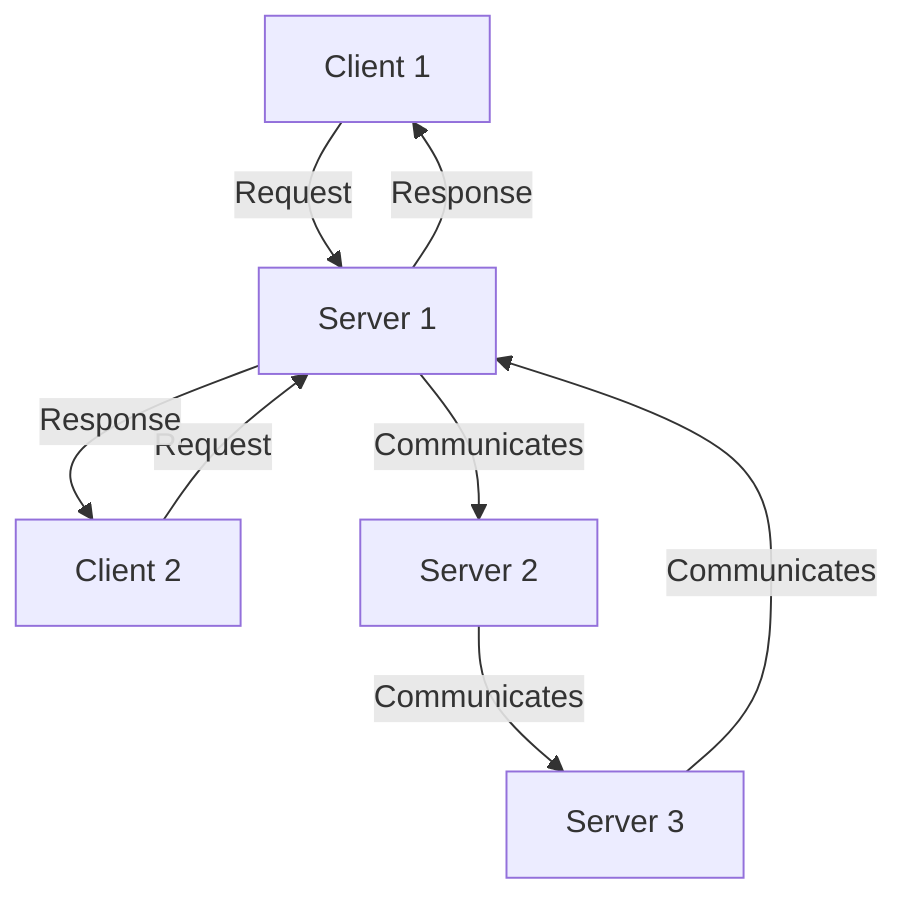
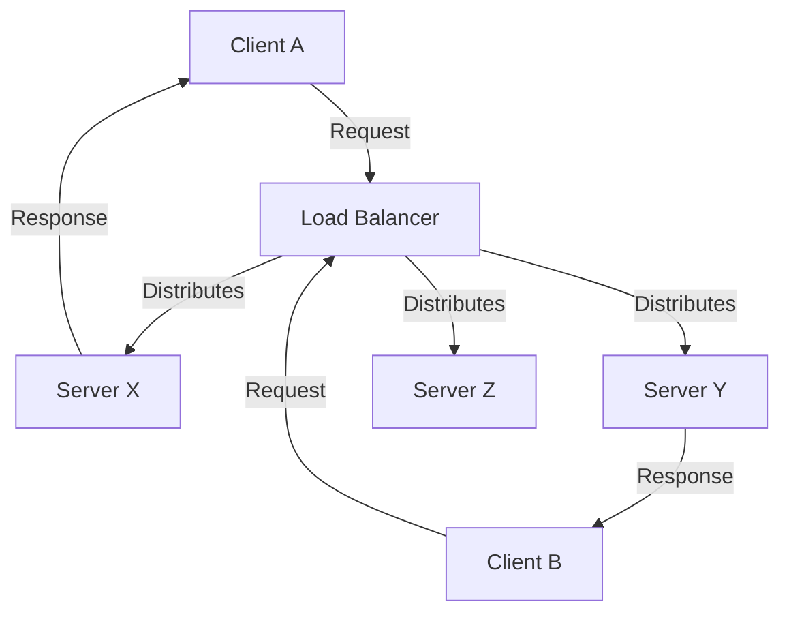

Distributed computing is a field of computer science that studies distributed systems. A distributed system is a system whose components are located on different networked computers, which communicate and coordinate their actions by passing messages to one another and serving as the one single service.

Below is a diagram illustrating a basic distributed system architecture:

## Diagram: Distributed System with Load Balancer

Here is another diagram showing a distributed system with a load balancer:

These diagrams provide a visual representation of how distributed systems operate and how components interact within the system.
