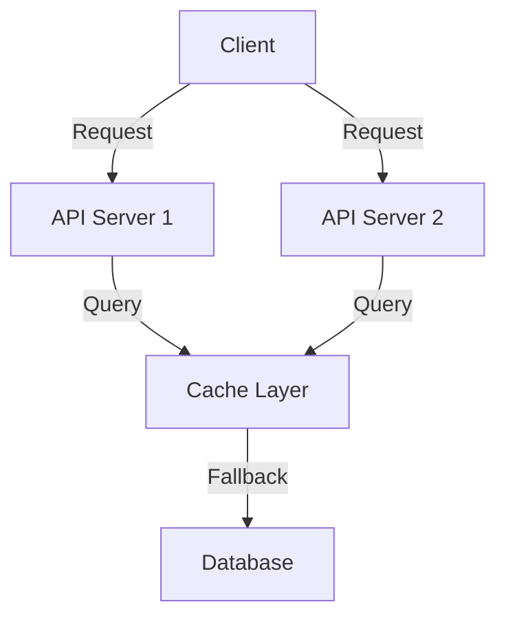
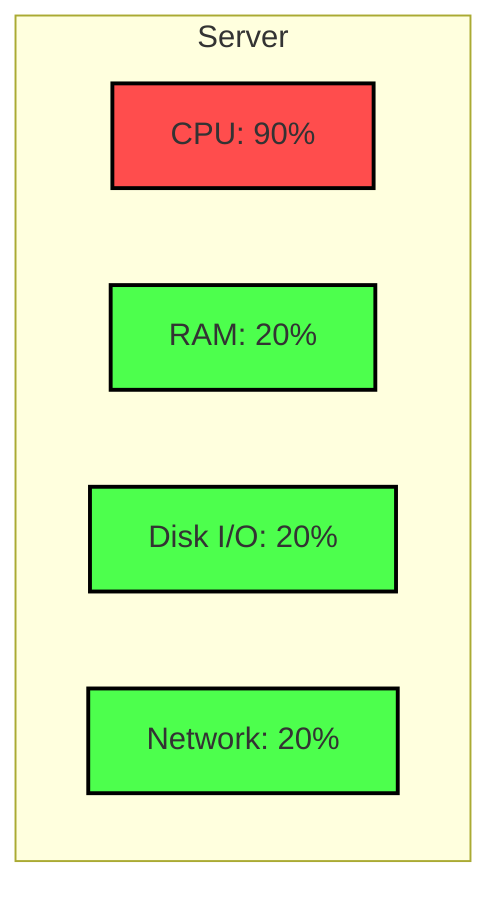
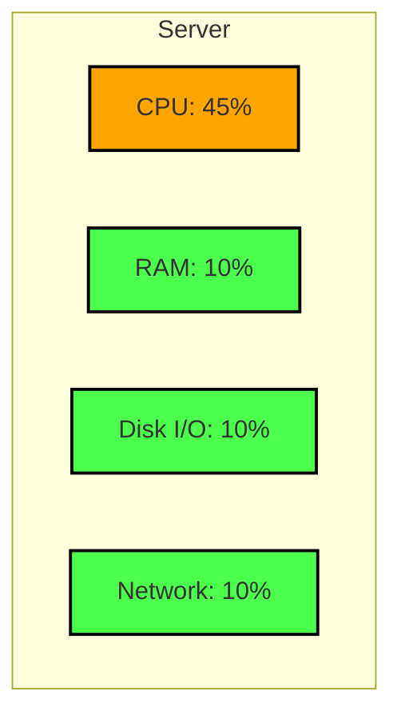

    Move the Database out of the API server.

When scaling an API server with the database inside, it can lead to several issues. Below is an example illustrating why this approach is not ideal.

### Problem: Coupling API Server and Database

#### Issues:
1. **Database Bottleneck**: All API servers directly access the same database, creating a single point of contention.
2. **Scalability Limits**: Adding more API servers increases load on the database, which may not scale horizontally as easily.
3. **Data Consistency**: Concurrent writes from multiple API servers can lead to data consistency issues.
4. **Tight Coupling**: The database is tightly coupled with the API servers, making it harder to scale or replace components independently.

### Better Approach: Decoupling with a Stateless API and Caching Layer

#### Benefits:
1. **Reduced Database Load**: The cache layer handles frequent queries, reducing direct database access.
2. **Improved Scalability**: API servers and the cache layer can scale independently.
3. **Stateless API**: Decoupling the database allows API servers to remain stateless, simplifying horizontal scaling.
4. **Better Performance**: Caching improves response times for frequent requests.

By decoupling the database and introducing a caching layer, the system becomes more scalable and resilient.

---

## What can you scale?

[[Vertical Scaling]] [[Horizontal Scaling]]

When scaling an API server, it's essential to consider the following resources:

#### 1. **CPU**
**Vertical Scaling**: Increase the number of CPU cores or upgrade to faster processors to handle more requests per second.
**Horizontal Scaling**: Add more API server instances to distribute the load across multiple CPUs.

#### 2. **RAM**
**Vertical Scaling**: Add more memory to handle larger datasets or more in-memory operations.
**Horizontal Scaling**: Distribute memory usage across multiple servers to avoid overloading a single instance.

#### 3. **Disk I/O**
 **Optimize Storage**: Use faster storage solutions like SSDs to reduce latency.
**Distribute Load**: Implement sharding or partitioning to spread disk I/O across multiple servers.

#### 4. **Network Bandwidth**
**Increase Capacity**: Upgrade network interfaces or use load balancers to handle higher traffic.
 **Reduce Usage**: Compress responses and optimize API payloads to minimize bandwidth consumption.

#### Example (2x):

Consider the scenario where your API Server with the usage of **90% CPU**, 20% Everything else, scaling the server 2x will make **CPU 45%** but also making everything else **10%**, which is unnecessary.

**From**

**To**

---

## Horizontally scale to at least 2 nodes first

Scaling to at least two nodes ensures **High Availability (HA)** and eliminates the risk of a **Single Point of Failure (SPOF)**. If one node fails, the other can continue serving requests, maintaining system uptime. [[high availability]] [[Single Point of Failure]]

### Understanding Diminishing Returns in Scaling

When scaling a system, it's important to recognize the concept of diminishing returns. This occurs when the incremental benefit of adding more resources decreases over time.

#### Example: API Server Scaling

Start scaling your server vertically, **until** there is this point where keep scaling vertically will give you less benefit with same amount cost, that's when we switch to horizontal scaling   

1. **Initial Scaling**: Adding a second API server can double the capacity, significantly improving performance and reliability.
2. **Subsequent Scaling**: Adding a third or fourth server may still improve performance, but the gains are smaller compared to the initial scaling.
3. **Resource Contention**: As more servers are added, shared resources like the database or network bandwidth can become bottlenecks, limiting the effectiveness of additional scaling.

![[Pasted image 20250420170856.png]]