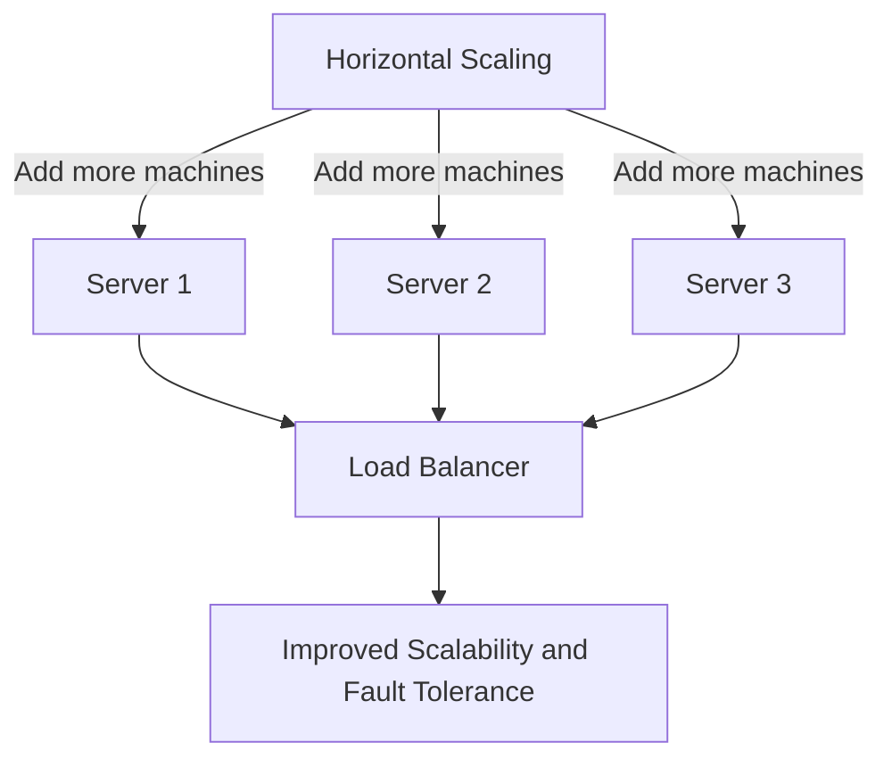

Horizontal scaling, also known as "scaling out," refers to the process of adding more machines or servers to a system to handle increased workload. This approach distributes the load across multiple nodes, improving the system's capacity and fault tolerance.

## Diagram

## Advantages
1. **Scalability**: Virtually unlimited as more machines can be added to the system.
2. **Fault Tolerance**: Failure of one machine does not bring down the entire system.
3. **Cost Efficiency**: Commodity hardware can be used instead of expensive high-end machines.

## Disadvantages
1. **Complexity**: Requires managing distributed systems and ensuring proper load balancing.
2. **Consistency Challenges**: May require additional effort to maintain data consistency across nodes.
3. **Network Overhead**: Communication between nodes can introduce latency.

## Use Cases
- Suitable for applications with high traffic and unpredictable workloads.
- Ideal for systems requiring high availability and fault tolerance, such as web applications and distributed databases.

## Comparison with Vertical Scaling
| Aspect                | Vertical Scaling         | Horizontal Scaling       |
|-----------------------|--------------------------|--------------------------|
| Approach              | Upgrade a single machine | Add more machines        |
| Complexity            | Low                      | High                     |
| Scalability Limit     | Limited by hardware      | Virtually unlimited      |
| Fault Tolerance       | Low                      | High                     |

Horizontal scaling is often the preferred approach for large-scale systems where scalability and fault tolerance are critical. It complements vertical scaling by addressing its limitations.  