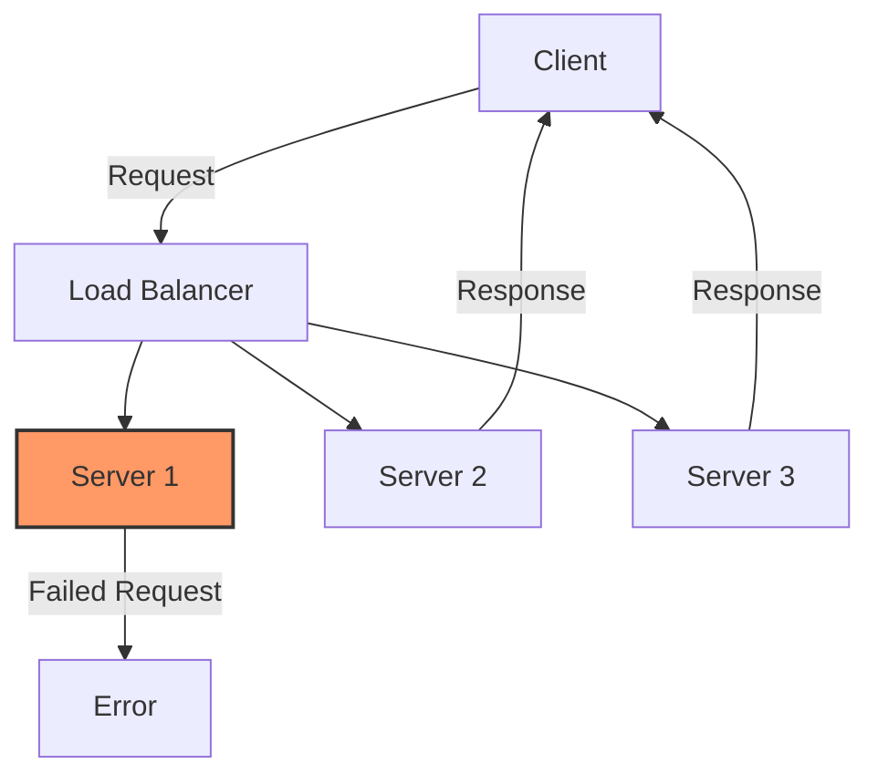
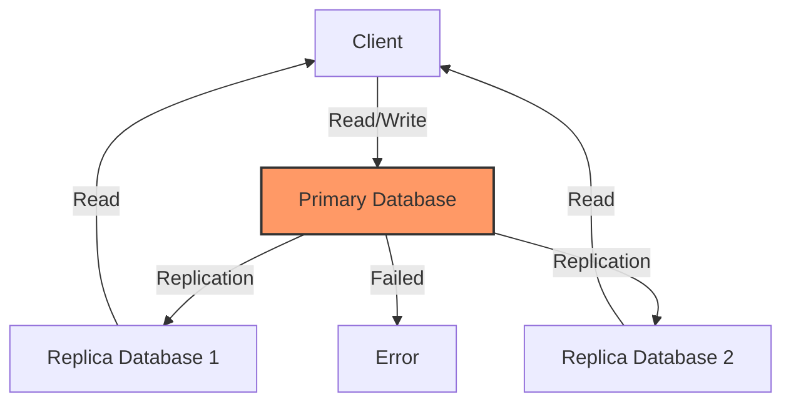
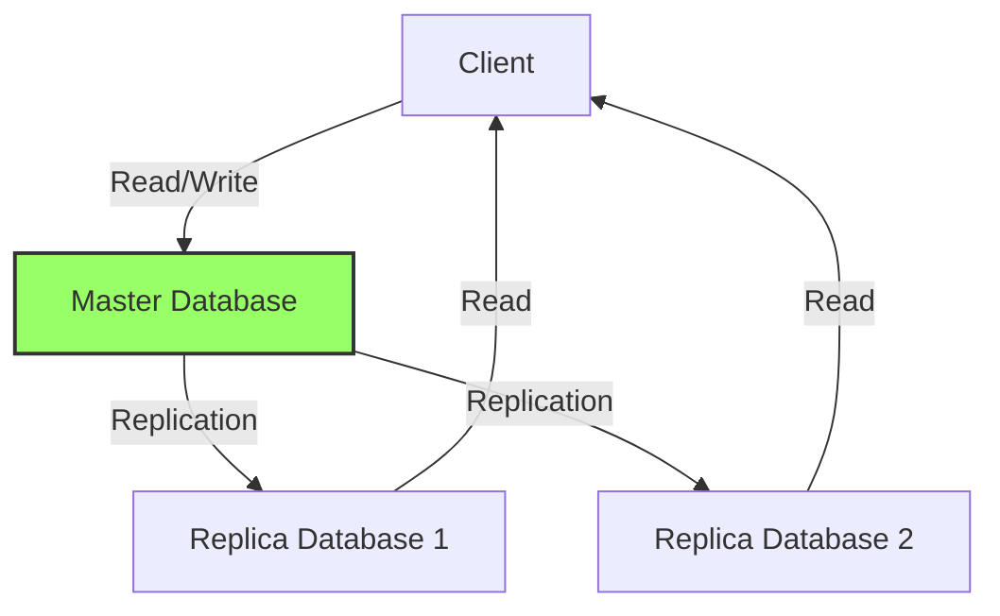

Redundancy is a key concept in system design that ensures [[high availability]] and **fault tolerance**. By duplicating critical components or functions of a system, redundancy helps to minimize the impact of failures and maintain system reliability.

#### Types of Redundancy

1. **Hardware Redundancy**: Duplicating physical components such as servers, storage devices, or network equipment.
2. **Software Redundancy**: Running multiple instances of software services to handle failures.
3. **Data Redundancy**: Storing copies of data in multiple locations to prevent data loss.

#### Benefits of Redundancy

- **Fault Tolerance**: Ensures the system continues to operate even if a component fails.
- **High Availability**: Reduces downtime and improves user experience.
- **Disaster Recovery**: Facilitates recovery in case of catastrophic failures.

---

#### Example: Load Balancer with Redundant Servers

Below is a simple example of a redundant system using a load balancer and multiple servers:

In this example, if **Server 1** fails (indicated in orange), the load balancer will continue routing requests to **Server 2** and **Server 3**, ensuring uninterrupted service.

---

#### Example: Database Replication for Redundancy

Database replication is a common strategy to ensure data redundancy and high availability. Below is an example of a primary-replica database setup:

In this setup, the **Primary Database** handles all write operations, while the **Replica Databases** are used for read operations. If the primary database fails, a failover mechanism can promote one of the replicas to act as the new primary, ensuring continuity.

---

#### Example: Database Cluster with Three Databases

A database cluster with three databases can provide both redundancy and scalability. Below is an example of such a setup:

In this configuration:
- The **Master Database** handles all write operations and replicates data to the replicas.
- **Replica Database 1** and **Replica Database 2** handle read operations, reducing the load on the master.
- If the master fails, a failover mechanism can promote one of the replicas to act as the new master, ensuring system continuity.
- This setup provides both redundancy and [[Scalability]] for read-heavy workloads.

This setup enhances both the availability and scalability of the system.

> Importance of [[Consistency]] in Redundant Systems  
> Consistency is a critical aspect of redundancy, especially in systems that involve data replication. Ensuring consistency means that all copies of data remain synchronized across redundant components. Without consistency, users may encounter outdated or conflicting information, which can degrade the reliability of the system.

This setup ensures that if one server fails, the load balancer can redirect traffic to the remaining servers, maintaining system availability.