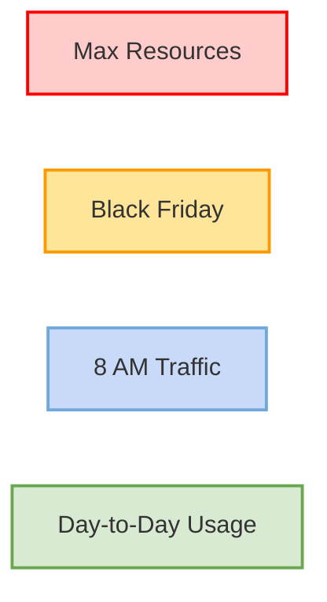

### Scalability

Scalability refers to a system's ability to handle increased load or demand by adding resources such as hardware, software, or network capacity. A scalable system can grow efficiently without compromising performance, reliability, or cost-effectiveness. **Should always have a space above the day to day usage to support unexpected usage**

#### Scalability Diagram

Below is a conceptual diagram illustrating system resource usage under different scenarios:

This diagram uses a hierarchical flow to represent system capacity, with different levels indicating varying usage scenarios. It highlights the importance of designing for scalability to handle peak loads efficiently.

#### Types of Scalability

1. **Vertical Scalability (Scaling Up)** [[Vertical Scaling]] 
    Adding more power (CPU, RAM, etc.) to an existing machine to handle increased load.

2. **Horizontal Scalability (Scaling Out)** [[Horizontal Scaling]]
    Adding more machines or nodes to distribute the load across multiple systems.

3. **Elasticity**  
        The ability of a system to dynamically allocate or release resources based on current demand, ensuring optimal resource utilization and cost efficiency. It's usually done by cloud providers. Check the service is elastic.

#### SPOF (Single Point of Failure) [[Single Point of Failure]]
A Single Point of Failure (SPOF) is a component in a system that, if it fails, will cause the entire system to stop functioning. Identifying and mitigating SPOFs is crucial for building scalable and reliable systems.

#### Key Considerations

- **Performance**: Ensure the system maintains acceptable response times under increased load.
- **Cost**: Balance scalability with cost-effectiveness.
- **Reliability**: Avoid single points of failure when scaling.
- **Elasticity**: Adapt to fluctuating demand dynamically.

#### Examples

- **Web Applications**: Using load balancers to distribute traffic across multiple servers.
- **Databases**: Implementing sharding or replication to handle large datasets.

Scalability is a critical aspect of system design, ensuring systems can grow with user demand while maintaining efficiency and reliability.
