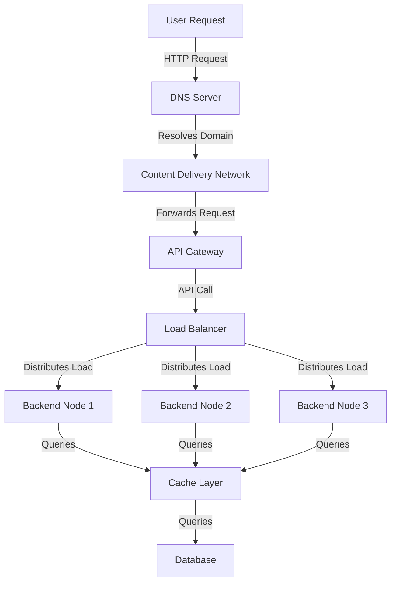

### User Layer
The user layer represents the end-users who initiate requests to the system. These requests are typically made through a web browser or mobile application, using HTTP protocols.

### DNS Layer
The DNS (Domain Name System) server resolves the domain name of the requested resource into an IP address. This step ensures that the user's request is routed to the correct server.

### CDN Layer
The Content Delivery Network (CDN) caches static assets such as images, stylesheets, and scripts to reduce latency and improve load times. If the requested resource is not cached, the request is forwarded to the API Gateway.

### API Gateway Layer
The API Gateway acts as a single entry point for all client requests. It handles tasks such as request routing, authentication, and rate limiting before forwarding the request to the Load Balancer.

### Load Balancer Layer
The Load Balancer distributes incoming requests across multiple backend nodes to ensure high availability and scalability. It prevents any single backend node from becoming a bottleneck.

### Backend Layer
The backend nodes process the requests and execute the business logic. Each backend node is capable of handling queries independently and communicates with the cache layer to retrieve or store data.

### Cache Layer
The cache layer stores frequently accessed data to reduce the load on the database and improve response times. If the requested data is not found in the cache, the query is forwarded to the database. This is in memory thing stored in RAM. Usually the 80% of requests are accessing 20% of information, which is known as the **80/20 rule** or **Pareto Principle**. This principle implies that a small subset of data is accessed most frequently, making caching an effective strategy to optimize performance. Popular caching solutions include **Redis**, **Memcached**, and **Hazelcast**, which are designed to handle high-throughput, low-latency operations.

### Database Layer
The database layer is responsible for storing and managing the application's data. It handles queries from the cache layer and ensures data consistency and reliability. 

#### Standby Database
A standby database is a replica of the primary database that remains synchronized with it. It is used as a backup to ensure high availability and disaster recovery. In case the primary database fails, the standby database can take over operations with minimal downtime. This setup is often implemented using techniques like **replication** or **log shipping**. Standby databases are critical for maintaining business continuity in large-scale systems.

