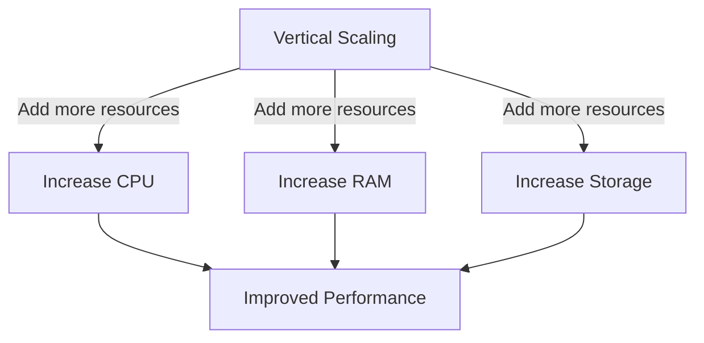

Vertical scaling, also known as "scaling up," refers to the process of increasing the capacity of a single server or machine to handle a larger workload. This is typically achieved by adding more resources, such as CPU, RAM, or storage, to the existing system.

## Diagram

## Advantages
1. **Simplicity**: Easier to implement as it involves upgrading a single machine.
2. **Consistency**: No need to manage distributed systems, reducing complexity.
3. **Lower Latency**: All operations occur on a single machine, avoiding network overhead.

## Disadvantages
1. **Hardware Limits**: Physical constraints on how much a single machine can be upgraded.
2. **Single Point of Failure**: If the machine fails, the entire system goes down.
3. **Cost**: High-end hardware upgrades can be expensive.

## Use Cases
- Suitable for applications with low to moderate traffic.
- Ideal for systems where simplicity and consistency are more critical than scalability.

## Comparison with Horizontal Scaling
| Aspect                | Vertical Scaling         | Horizontal Scaling       |
|-----------------------|--------------------------|--------------------------|
| Approach              | Upgrade a single machine | Add more machines        |
| Complexity            | Low                      | High                     |
| Scalability Limit     | Limited by hardware      | Virtually unlimited      |
| Fault Tolerance       | Low                      | High                     |

Vertical scaling is often a good starting point for small systems but may need to be complemented with horizontal scaling as demand grows.